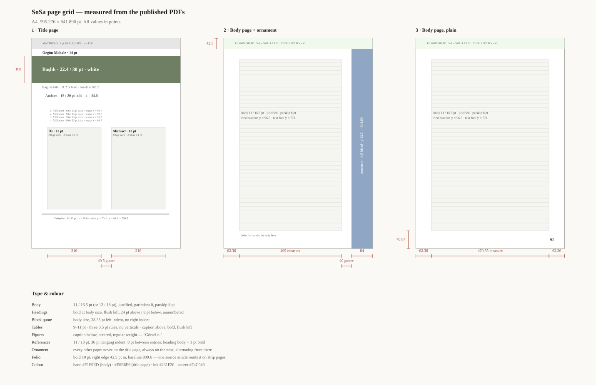

# `sosa.cls` — LaTeX class for *Sosyal Bilimler ve Sağlık Bülteni* (SoSa)

A LaTeX/Overleaf reproduction of the SoSa journal page design, reverse-engineered
from two typeset issues (2026;BAHAR(18) pp. 19–35 and pp. 60–70) plus the
journal's Word submission template.

The hard part of this layout is the **full-bleed illustration strip down the
right edge of the page** — it changes artwork page to page, appears on every
other page, and steals width from the text column. Section
[The ornament engine](#the-ornament-engine) explains how the class handles it.

---

## Files

| Path | What it is |
|---|---|
| `frontmatter.tex` | **Start here.** Page one as a fill-in form: journal and issue, titles, authors, affiliations, both abstracts, colophon. |
| `body.tex` | The article text. |
| `references.tex` | The reference list. |
| `main.tex` | Thin driver — the ornament artwork list, then it pulls in the three files above. |
| `sosa.cls` | The class. Everything lives here. |
| `skeleton.tex` | Single-file blank starter, if you would rather not split the article across files. |
| `AGENTS.md` | Instructions for an AI assistant asked to typeset a manuscript with this template. Also `CLAUDE.md` and `.github/prompts/new-article.prompt.md`. |
| `ARTWORK.md` | How to commission the banner and the side strips from an image model: exact sizes, the era/style/artist interview, prompt templates. |
| `tools/crop-artwork.py` | Crops any generated image to the exact pixel size the layout needs. |
| `HANDOFF.md` | Full engineering handoff — measurements, architecture, what is and is not verified, revision cookbook. Start here if you are changing the layout. |
| `assets/ornaments/*.jpg` | The ten side-strip illustrations lifted from the two source issues. Swap in your own. |
| `assets/hero/*.jpg` | Two title-page banner images. |
| `latexmkrc` | Runs the two passes `sosawide` needs. |
| `docs/layout-spec.svg` | The measured page grid, drawn to scale — title page, strip page, plain page. |
| `tools/make-layout-spec.py` | Regenerates that diagram. |



## Quick start

**Overleaf** — upload the whole folder, set *Menu → Compiler* to **pdfLaTeX**
(XeLaTeX and LuaLaTeX also work), open `main.tex`, hit Recompile. Overleaf runs
latexmk, so the two passes happen on their own.

Then edit, in order: **`frontmatter.tex`** (page one), `body.tex` (the text),
`references.tex`. `main.tex` only holds the artwork list — you rarely touch it,
and `sosa.cls` you never do.

**Locally**

```sh
latexmk -pdf main.tex        # or: pdflatex main.tex  (twice)
```

Compile **twice**. The `sosawide` environment tells the class, via the `.aux`
file, which pages must drop their ornament, and that information only lands on
the second pass.

## Class options

```latex
\documentclass[ornament=alternate,fontsize=11,lang=turkish]{sosa}
```

| Option | Values | Default | Effect |
|---|---|---|---|
| `ornament` | `alternate` \| `all` \| `none` | `alternate` | Which pages carry the side strip. `none` also widens the text column to the full measure. |
| `fontsize` | `11` \| `12` | `11` | Body size. Both appear in the journal: quantitative articles at 11pt/16.5pt, qualitative ones at 12pt/18pt. |
| `lang` | `turkish` \| `english` | `turkish` | babel main language (shorthands off) and the `Tablo`/`Görsel` caption words. |
| `ornamentfit` | `cover` \| `stretch` | `cover` | `cover` scales the artwork to the band height and crops it centred, so nothing is distorted. `stretch` squeezes it to fit, which is what the original PDFs actually do on some pages. |
| `proof` | flag | off | Draws the text block, the strip edge and the full measure as thin coloured guides. Useful when you are nudging the front page. |
| `nofont` | flag | off | Skip the EB Garamond setup and use whatever your preamble loads. |
| `headstyle` | `auto` \| `sentence` \| `uppercase` \| `smallcaps` | `auto` | How the masthead and running head are cased — see [Turkish case in the heads](#turkish-case-in-the-heads). |
| `figures` | `oldstyle` \| `lining` | `oldstyle` | Digit style. The published journal uses **lining** figures; `oldstyle` is kept as the default only because it is what the current EB Garamond setup gives. |

## Front matter

Page one lives in `frontmatter.tex`, laid out as eight numbered blocks you fill
in. It compiles into the masthead, the banner, the title, the author block, the
two abstract panes and the colophon.

### Journal and issue — give these once

```latex
\SosaJournal      {Sosyal Bilimler ve Sağlık Bülteni}
\SosaJournalShort {SoSa}
\SosaYear         {2026}
\SosaIssue        {Bahar}{18}     % season label, issue number
\SosaPages        {60}{70}        % first and last printed page
\SosaArticleType  {Özgün Makale}
```

Three strings are built from these rather than typed three times:

| Derived | Looks like |
|---|---|
| masthead line | `Sosyal Bilimler ve Sağlık Bülteni (SoSa). 2026; Bahar(18):60-70` |
| running head | `<short title>. SoSa. 2026;Bahar(18)` |
| suggested citation | `<authors> (2026). <Turkish title>. `*`journal (SoSa), Bahar(18),`*` 60-70` |

Set `\SosaMasthead{}`, `\SosaRunningHead{}` or `\SosaCitation{}` by hand only
when the derived version is wrong — an explicit value always wins.

`\SosaPages` also sets the page counter **and** anchors the ornament
alternation. A bare `\setcounter{page}{60}` will not do it.

### Titles

```latex
\SosaTitleTR{Türkçe başlık}          % white, inside the banner
\SosaTitleEN{English title}          % bold, under the banner
\SosaShortTitle{Kısa başlık}         % optional; defaults to the Turkish title
```

### Authors and affiliations — one line each

```latex
\SosaAuthor{Murat Aysin}{1}{0000-0001-0000-0001}
\SosaAuthor{Sultan Eser}{2}{}          % ORCID may be empty
\SosaAuthor{Ali Ceylan}{1,4}{0000-…}   % more than one affiliation

\SosaAffiliation{Dr. Öğr. Üyesi, Balıkesir Üniversitesi, …}
\SosaAffiliation{Prof. Dr., Sağlık Bilimleri Üniversitesi, …}
```

The commas between names, the superscript numbers and the ORCID marks are
inserted for you; the affiliations are numbered in the order you give them. To
hand-build the whole line instead, `\author{…}` and `\SosaAffiliations{\item …}`
still work and override.

### Abstracts

```latex
\SosaOz{\textbf{Giriş:} … \textbf{Gereç-Yöntem:} …}
\SosaKeywordsTR{birinci, ikinci, üçüncü}
\SosaAbstract{\textbf{Introduction:} …}
\SosaKeywordsEN{first, second, third}
\SosaNote{Optional line under the abstracts: congress, funding, thesis …}
```

### Colophon

```latex
\SosaReceived{16.05.2026}  \SosaAccepted{12.06.2026}  \SosaPublished{19.06.2026}
\SosaCorrespondingAuthor{Ad Soyad}
\SosaCorrespondingEmail{ad.soyad@kurum.edu.tr}
\SosaHandlingEditor{Ad Soyad}
\SosaCitationAuthors{Soyad, A., \& Soyad, B.}   % the rest is derived
```

## The banner and the title

The title is set in white across the banner image at the top of page one.
Banner artwork is chosen for the issue, not for the words that have to sit on
it, so a light or busy picture can swallow the type. Three knobs, in `main.tex`
next to `\SosaHero`:

```latex
\SosaHeroScrim{0.35}          % a wash over the banner; 0 = off, 1 = opaque
\SosaHeroScrimColor{black}    % what colour that wash is
\SosaTitleColor{white}        % the title itself
```

The scrim is painted into the page background, between the picture and the
title, so it darkens the image without touching the type. For a pale banner you
can go the other way instead — `\SosaHeroScrim{0}` with
`\SosaTitleColor{sosaink}`.

## Turkish case in the heads

The masthead and the running head were originally set in small caps, following
the printed journal. Small caps turn a lower-case `i` into a **dotless** small
capital, and in Turkish that is a different letter — *Bilimler* came out as
BILIMLER where it has to read BİLİMLER, and *Balıkesir* as BALIKESIR.

Composing the dot as an accent over the small capital was tried and rendered
with no dot at all under T1 + EB Garamond. Rather than keep guessing, the
default now applies **no case mapping at all**: the head is set exactly as you
typed it, which for correctly written Turkish is correct by construction.

```latex
\SosaHeadStyle{sentence}    % no transformation, exactly as typed (default)
\SosaHeadStyle{uppercase}   % \MakeUppercase -- İ correct, and closest to the
                           % printed journal, which sets these heads in capitals
\SosaHeadStyle{smallcaps}   % small caps, with a scaled İ substituted for each i
\SosaHeadStyle{asis}        % synonym for sentence
```

`uppercase` is worth trying: `\MakeUppercase` is locale-aware under
babel-turkish, so it maps i → İ and ı → I correctly, and full capitals are what
the journal actually prints. Under `lang=english` the default is plain
`\textsc`, since none of this applies.

## The ornament engine

### What the journal actually does

Measured across both source issues:

* The strip is a full-bleed image running from the bottom of the header band
  (y = 42.5pt) to the foot of the sheet, hard against — and slightly past — the
  right paper edge.
* It never appears on the title page, always appears on the page after it, and
  alternates from there. In the pp. 60–70 article that lands on odd printed
  pages; in the pp. 19–35 article, even ones. Same rule, different parity,
  because the articles start on different pages.
* The artwork changes on every strip page.
* Its width wobbles: 85.0, 85.4, 84.4, 78.5, 66.4, 64.0pt across the sample.
  That is hand placement, not a system.
* On strip pages the text column is narrower (≈414pt against ≈473pt) and, in
  one of the two articles, also shifted 5.7pt left.
* Every wide table in both articles sits on a page **without** a strip.
* The folio falls underneath the strip. One of the two articles simply omits it
  on strip pages; the other prints it over the artwork.

### What the class does

```latex
\SosaOrnamentCycle{assets/ornaments/ornament-01,%
                   assets/ornaments/ornament-02,%
                   assets/ornaments/ornament-03}
\SosaHero{assets/hero/hero-01}
```

The cycle is consumed in order by the pages that get a strip, so three files
across eight strip pages repeat 1-2-3-1-2-3-1-2. Per-page control:

```latex
\SosaOrnament{65}{assets/ornaments/ornament-07}  % pin one file to printed page 65
\SosaNoOrnament{63,67}                           % no strip on these printed pages
\SosaForceOrnament{62}                           % strip on a page that would not get one
\SosaNoOrnamentHere                              % no strip on whatever page this lands on
\SosaOrnamentHere                                % force one there
```

The `…Here` forms travel through the `.aux` file, so they need a second pass.

Geometry knobs, if your artwork wants different proportions:

```latex
\setlength{\sosaornamentwidth}{84pt}    % visible width of the strip
\setlength{\sosaornamentgutter}{40pt}   % white space between text and strip
```

Both must be set **before** `\documentclass` takes effect — i.e. edit them in
`sosa.cls` — because the text measure is derived from them at load time.

The folio is printed over the strip by default. To drop it on strip pages, as
the pp. 60–70 article does, put this in your preamble:

```latex
\SosaHideFolioOnOrnamentPages    % \SosaShowFolioOnOrnamentPages restores it
```

### Why the text measure is constant

The original narrows the column on strip pages and widens it on the others.
This class keeps one measure throughout, and that is a deliberate departure.

LaTeX sets paragraphs before it decides where pages break, so "make the line
shorter if it lands on an odd page" is not a question the paragraph builder can
answer. Packages that fake it (per-page frame configurations) trade away
footnotes, floats and robustness — a bad deal for a template other people have
to compile.

What you get instead: the right-hand reserve is always kept clear, whether or
not a strip is painted into it, so the measure is stable and facing pages stay
in register — something the hand-made original does not manage. The one cost is
recovered explicitly:

```latex
\begin{table}[!ht]
\begin{sosawide}
  \caption{A table that needs the whole page width}
  \begin{sosatabular}{@{}L{150pt}L{130pt}R{110pt}@{}} ... \end{sosatabular}
\end{sosawide}
\end{table}
```

`sosawide` takes back the reserved band **and** suppresses that page's strip —
exactly the pattern the journal uses for its own wide tables. `sosawidekeep`
does the same without dropping the strip, for a block that only just overflows.

If you would rather have the strip on every page, `ornament=all` gives a
perfectly consistent result and needs no thought at all.

## Body matter

Sections are unnumbered and set bold at body size:

```latex
\section{Giriş}
\subsection{Alt başlık}
```

Interview excerpts and long quotations use `quote` — indented 1cm on the left
only, no right indent, no size change, matching the qualitative article:

```latex
\begin{quote}
Mesela bir ev temizliyorsunuz\ldots (K14)
\end{quote}
```

### Tables

Three rules, no verticals, caption above and bold:

```latex
\begin{table}[!ht]
\caption{Katılımcıların Sosyodemografik Özellikleri}
\label{tab:demog}
\begin{sosatabular}{@{}L{170pt}L{90pt}R{140pt}@{}}
\textbf{Değişkenler} & & \textbf{Sayı (\%)} \\
\midrule
Yaş & 50 yaş altı & 386 (\%54,0) \\
    & 50 yaş ve üzeri & 329 (\%46,0) \\
\end{sosatabular}
\end{table}
```

`sosatabular` puts in the `\toprule` and `\bottomrule`; you add the `\midrule`
under the head. It takes an optional first argument for the type size —
`\sosatablesize` (10pt, the default) or `\sosatablesmall` (9pt, for dense
tables like the source's Table 1):

```latex
\begin{sosatabular}[\sosatablesmall]{@{}L{150pt}...@{}}
```

`L{}`, `C{}` and `R{}` are ragged-right, centred and ragged-left paragraph
columns.

### Figures

```latex
\begin{figure}[!ht]
  \centering
  \includegraphics[width=0.62\textwidth]{figures/gorsel-1}
  \caption{Ev içi emekle ilgili yorumların ait olduğu fotoğraflardan örnekler}
\end{figure}
```

Captions come out as `Görsel 1. …`, regular weight, centred, below the image.

### References

APA 7, 36pt hanging indent, single-spaced, 8pt between entries. Blank lines
separate the entries:

```latex
\begin{sosareferences}

Alum, E. U., \& Ugwu, O. P.-C. (2025). Artificial intelligence in disease
diagnosis and treatment. \textit{Discover Applied Sciences, 7}(3), 193.
\url{https://doi.org/10.1007/s42452-025-06616-y}

Beets, B., Newman, T. P., \& Howell, E. L. (2023). Surveying public
perceptions\ldots

\end{sosareferences}
```

Prefer BibLaTeX? Load it in the preamble and use the supplied heading:

```latex
\usepackage[style=apa,backend=biber]{biblatex}
\addbibresource{references.bib}
\SosaStyleBibliography
...
\printbibliography[heading=sosa]
```

## The measurements

Everything below was read off the published PDFs. A4 is 595.276 × 841.890pt.

### Page

| | Value |
|---|---|
| Header band | full bleed, 0 → 42.5pt from the top |
| Band colour, body pages | `#F1F9ED` |
| Band colour, title page | `#E6E6E6` |
| Text ink | `#231F20` |
| Left margin | 62.36pt (2.2cm) — matches the Word template |
| Right margin, no strip | 62.36pt → measure 470.6pt |
| Strip, left edge | 511.6pt (visible width ≈ 83.7pt) |
| Text right edge with strip | 470.5pt → measure ≈ 414pt |
| Bottom margin | 70.87pt (2.5cm) |
| First body baseline | 96.5pt from the top (11pt setting); 103.2pt (12pt) |
| Running head | small caps, ~7–8pt, baseline 24.5pt, flush left at 45pt |
| Folio | bold 10pt, baseline 32.3pt above the foot, right edge 42.5pt in |

### Type

| Element | Size / leading | Notes |
|---|---|---|
| Body | 11/16.5 or 12/18 | justified, `\parindent` 0, `\parskip` 8pt |
| Section heading | body size, bold | 24pt above, 8pt below |
| Block quote | body size | 28.35pt left indent, no right indent |
| Table body | 9–11pt | rules 0.5pt |
| Table caption | body size, bold | above, flush left |
| Figure caption | body size, regular | below, centred |
| References heading | body size + 1pt, bold | `Kaynaklar` |
| References | 11/13 | 36pt hanging indent |

### Title page

| Element | Position (from paper top) | Type |
|---|---|---|
| Masthead line | baseline 24.5pt, x = 43.6pt | small caps 9pt |
| Article type | baseline 63.5pt, x = 43.1pt | bold 14pt |
| Hero band | 71 → 179pt, full bleed | — |
| Turkish title | vertically centred in the band, x = 42.5pt | bold 22.4/30pt, white |
| English title | baseline 201.5pt | bold 11.2pt |
| Authors | baseline 235.5pt, x = 54.5pt | bold 15/20pt, superscripts 8.7pt |
| Affiliations | baseline 295.5pt, numbers at 73.7pt, text at 91.7pt | italic 9.6/13pt |
| Öz / Abstract heads | floats with the block above | bold 13pt |
| Abstract panes | x = 62.4 and 318.9pt, 216pt wide | 8pt on a 7.1pt baseline |
| Colophon rule | 704.1pt, x = 40.3 → 550.5pt, 1.42pt thick | — |
| Colophon text | baseline 721.4pt, x = 90.6pt | 8/13pt |

The abstract panes in the source really are set 8pt on a 7.1pt baseline, which
is tighter than LaTeX will look comfortable with. The class defaults to 9pt.
For an exact match:

```latex
\SosaAbstractLeading{7.1pt}
```

Everything above the English title, and the whole colophon, is stamped at fixed
coordinates. The block from the English title down to the abstract flows, so a
longer author list pushes the abstract down exactly as it does in the original.
If your front page needs nudging:

```latex
\setlength{\sosafirstblocktop}{188pt}   % top of the English title
\setlength{\sosaskipauthors}{14pt}      % English title  -> author line
\setlength{\sosaskipaffil}{6pt}         % authors        -> affiliations
\setlength{\sosaskipabstract}{26pt}     % affiliations   -> Öz / Abstract
```

Compile with the `proof` option to see where they land.

## Fonts

The journal is set in Adobe Garamond. The class uses **EB Garamond**, the
closest free equivalent — it has the Turkish glyphs (ğ İ ı ş ç ö ü) and real
small caps for the running head, and it is installed on Overleaf.

* pdfLaTeX → the `ebgaramond` package (`tlmgr install ebgaramond`)
* XeLaTeX / LuaLaTeX → `fontspec`, either the OTF files or a system install

If EB Garamond is missing the class warns and falls back to the default roman;
the layout still compiles, it just looks wrong. If you own Adobe Garamond Pro,
pass `nofont` and load it yourself with `fontspec`.

## Known departures from the source PDFs

Listed so you can decide whether you care:

1. **Constant text measure** instead of per-page narrowing. Reasoning above.
2. **Left margin normalised to 2.2cm.** One of the two articles uses 2.0cm on
   its strip pages and 2.2cm elsewhere; the Word template says 2.2cm.
3. **Abstract leading 9pt** rather than the source's 7.1pt, unless you call
   `\SosaAbstractLeading{7.1pt}`.
4. **EB Garamond, not Adobe Garamond.** Metrics are close but not identical, so
   line breaks will differ from the published PDFs.
5. **ORCID mark is drawn**, not the official bitmap.
6. **The folio is printed on strip pages** by default, matching the pp. 19–35
   article; `\SosaHideFolioOnOrnamentPages` matches the other one.

## Artwork

New artwork for an issue is commissioned from an image model — see
**[`ARTWORK.md`](ARTWORK.md)** for the exact sizes, the era / style / artist
interview to run first, and the prompt templates that keep the whole set in one
style. At 300 dpi the banner is 2480 × 450 px and each strip 350 × 3331 px;
`tools/crop-artwork.py` cuts whatever a generator hands you down to that.

`assets/ornaments/` and `assets/hero/` hold the illustrations extracted from
the two source issues, kept so the template compiles to something that looks
like the journal out of the box. They belong to SoSa — replace them with the
artwork for your own issue before publishing. Any tall, narrow image works;
`ornamentfit=cover` crops whatever aspect ratio you hand it.
